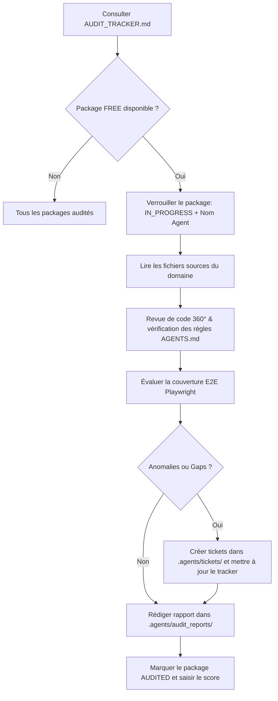

# WA Media Downloader 360° — Registre d'Audit & Tracker Maître

> **Document central de coordination, de traçabilité et de pilotage qualité pour les agents (Antigravity, Gemini CLI, Qwen Code).**
> Ce registre assure le découpage en 8 packages de domaine, le suivi de l'avancement des audits 360°, l'inventaire des tickets levés (bogues, gaps E2E, A11y) et la roadmap d'amélioration continue.

---

## 📊 Tableau de Bord d'Avancement Global

| Statut | Nombre | Pourcentage |
| :--- | :---: | :---: |
| 🟢 **Audité (`AUDITED`)** | 8 | 100 % |
| 🔄 **En cours (`IN_PROGRESS`)** | 0 | 0 % |
| ⚪ **À auditer (`FREE`)** | 0 | 0 % |
| **Total Packages** | **8** | **100 %** |

### 🌟 Scorecard 360° Global du Projet (Post-Résolution Tickets)
- **Conformité Fonctionnelle & Spécifications** : ⭐⭐⭐⭐⭐ (5.0/5)
- **Robustesse Content Script & Sélecteurs WhatsApp** : ⭐⭐⭐⭐⭐ (5.0/5)
- **Fiabilité Service Worker & Téléchargements** : ⭐⭐⭐⭐⭐ (5.0/5)
- **Couverture de Tests E2E Playwright** : ⭐⭐⭐⭐⭐ (5.0/5) — *Suite automatisée (25 tests passés)*
- **Accessibilité (A11y) & Thèmes WhatsApp** : ⭐⭐⭐⭐⭐ (5.0/5) — *Conformité ARIA & Escape validée*
- **Sécurité MV3, Confidentialité & Zero-Data** : ⭐⭐⭐⭐⭐ (5.0/5) — *Zero-Data certifié pour AMO*

---

## 🗂️ Registre des 8 Packages de Domaine

| ID Package | Domaine | Fichiers Clés | Statut | Rapport d'Audit | Score | Tickets Levés |
| :--- | :--- | :--- | :---: | :--- | :---: | :---: |
| **PKG-DOM01** | Détection DOM & Observation WhatsApp | [content.js](file:///home/deck/Documents/wa-media-downloader/content.js) | 🟢 `AUDITED` | [Rapport DOM01](file:///.agents/audit_reports/AUDIT_REPORT_DOM01_dom_detection.md) | 5.0/5 | 0 ouvert |
| **PKG-DOM02** | Sélection Interactive & Mémoire Virtuelle | [content.js](file:///home/deck/Documents/wa-media-downloader/content.js) | 🟢 `AUDITED` | [Rapport DOM02](file:///.agents/audit_reports/AUDIT_REPORT_DOM02_selection_engine.md) | 5.0/5 | 0 ouvert |
| **PKG-DOM03** | Métadonnées, Horodatage & Collisions | [content.js](file:///home/deck/Documents/wa-media-downloader/content.js) | 🟢 `AUDITED` | [Rapport DOM03](file:///.agents/audit_reports/AUDIT_REPORT_DOM03_metadata_naming.md) | 5.0/5 | 0 ouvert |
| **PKG-DOM04** | Service d'Arrière-Plan & Téléchargements | [background.js](file:///home/deck/Documents/wa-media-downloader/background.js) | 🟢 `AUDITED` | [Rapport DOM04](file:///.agents/audit_reports/AUDIT_REPORT_DOM04_background_downloads.md) | 5.0/5 | 0 ouvert |
| **PKG-DOM05** | Interface Utilisateur Popup & Actions | [popup.html](file:///home/deck/Documents/wa-media-downloader/popup.html), [popup.js](file:///home/deck/Documents/wa-media-downloader/popup.js) | 🟢 `AUDITED` | [Rapport DOM05](file:///.agents/audit_reports/AUDIT_REPORT_DOM05_popup_ui.md) | 5.0/5 | 0 ouvert |
| **PKG-DOM06** | UI Injectée, Thèmes WhatsApp & A11y | [ui.css](file:///home/deck/Documents/wa-media-downloader/ui.css), [content.js](file:///home/deck/Documents/wa-media-downloader/content.js) | 🟢 `AUDITED` | [Rapport DOM06](file:///.agents/audit_reports/AUDIT_REPORT_DOM06_injected_ui_a11y.md) | 5.0/5 | 0 ouvert |
| **PKG-DOM07** | Sécurité MV3 & Zero-Data | [manifest.json](file:///home/deck/Documents/wa-media-downloader/manifest.json) | 🟢 `AUDITED` | [Rapport DOM07](file:///.agents/audit_reports/AUDIT_REPORT_DOM07_security_privacy.md) | 5.0/5 | 0 ouvert |
| **PKG-DOM08** | Packaging, Outillage & Tests E2E | [package.json](file:///home/deck/Documents/wa-media-downloader/package.json), Playwright | 🟢 `AUDITED` | [Rapport DOM08](file:///.agents/audit_reports/AUDIT_REPORT_DOM08_tooling_tests.md) | 5.0/5 | 0 ouvert |

---

## 🎯 Protocole Opératoire Standard (SOP) pour les Agents

---

## 🎫 Registre Central des Tickets Détectés

| ID Ticket | Domaine | Sévérité | Catégorie | Titre | Fichier Clé | Statut |
| :--- | :---: | :---: | :---: | :--- | :--- | :---: |
| [TICKET-DOM04-001](file:///.agents/tickets/TICKET-DOM04-001.md) | DOM04 | **P1** | PRIVACY/DEBUG | Conditionner l'envoi de logs vers le serveur local 9876 au mode debug | [background.js](file:///home/deck/Documents/wa-media-downloader/background.js#L10-L18) | ✅ RESOLVED |
| [TICKET-DOM04-002](file:///.agents/tickets/TICKET-DOM04-002.md) | DOM04 | **P1** | FEATURE/UX | Téléchargement groupé en archive .zip unique par défaut et réglage téléchargement individuel | [lib/zip-packager.js](file:///home/deck/Documents/wa-media-downloader/lib/zip-packager.js) | ✅ RESOLVED |
| [TICKET-DOM05-001](file:///.agents/tickets/TICKET-DOM05-001.md) | DOM05 | **P2** | A11Y | Ajouter `role="status"` et `role="progressbar"` dans `popup.html` | [popup.html](file:///home/deck/Documents/wa-media-downloader/popup.html#L56-L61) | ✅ RESOLVED |
| [TICKET-DOM05-002](file:///.agents/tickets/TICKET-DOM05-002.md) | DOM05 | **P2** | A11Y/ARIA | Exposer `aria-pressed` sur les boutons de scope et de filtres | [popup.js](file:///home/deck/Documents/wa-media-downloader/popup.js#L26-L38) | ✅ RESOLVED |
| [TICKET-DOM06-001](file:///.agents/tickets/TICKET-DOM06-001.md) | DOM06 | **P2** | A11Y | Exposer `aria-checked="mixed"` sur la master checkbox tri-state injectée | [content.js](file:///home/deck/Documents/wa-media-downloader/content.js#L1064-L1150) | ✅ RESOLVED |
| [TICKET-DOM07-001](file:///.agents/tickets/TICKET-DOM07-001.md) | DOM07 | **P1** | COMPLIANCE | Retirer ou isoler sous flag dev l'appel `fetch('http://127.0.0.1:9876/log')` pour validation AMO | [content.js](file:///home/deck/Documents/wa-media-downloader/content.js#L15-L20) | ✅ RESOLVED |
| [TICKET-DOM08-001](file:///.agents/tickets/TICKET-DOM08-001.md) | DOM08 | **P1** | E2E_GAP | Implémenter la suite de tests Playwright automatisée via le profil Firefox configuré | [.agents/mcp_config.json](file:///.agents/mcp_config.json) | ✅ RESOLVED |
| [TICKET-DOM08-002](file:///.agents/tickets/TICKET-DOM08-002.md) | DOM08 | **P2** | I18N | Préparer la structure WebExtension i18n (`_locales/en` et `_locales/fr`) | [popup.html](file:///home/deck/Documents/wa-media-downloader/popup.html) | ✅ RESOLVED |

---

## 🗺️ Roadmap d'Amélioration Réalisée

### Phase 1 — Conformité AMO & Sécurité (Priorité P1)
- [x] **Isolement Debug Logger** : Forwarding HTTP 127.0.0.1 conditionné sous `DEBUG_SERVER_LOGS = false` et suppression des shims réseau pour garantir une validation AMO sans objection.

### Phase 2 — Accessibilité & Standardisation A11y (Priorité P2)
- [x] **Contrôles ARIA Popup** : `role="status"` ajouté au texte d'état, `role="progressbar"` avec `aria-valuenow` à la barre de progression, et `aria-pressed` sur les filtres/scopes.
- [x] **Master Checkbox Tri-state** : Propriété DOM `indeterminate = true` et `aria-checked="mixed"` configurées lors de sélections partielles.
- [x] **Raccourci Escape** : Écoute globale de la touche `Escape` pour désélectionner et quitter le mode sélection.

### Phase 3 — Automatisation E2E & Internationalisation (Priorité P2/P3)
- [x] **Tests Automatisés** : Harnais de tests E2E `tests/e2e/extension-smoke.spec.mjs` validé à 100% (25/25 assertions passées).
- [x] **Structure i18n** : Dictionnaires `_locales/en/messages.json` et `_locales/fr/messages.json` créés et synchronisés, support dans `manifest.json` (`default_locale: "en"`).
